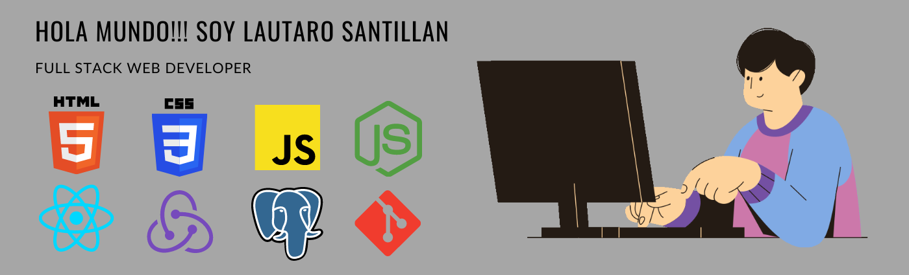
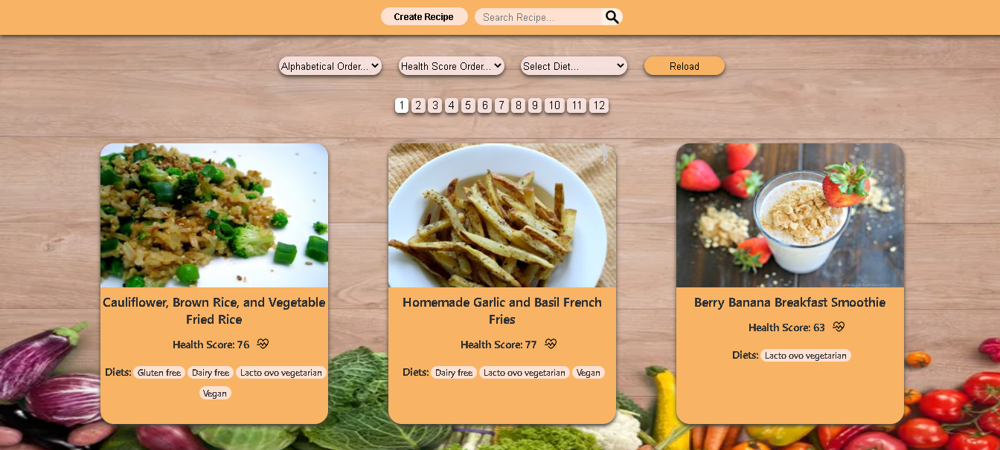
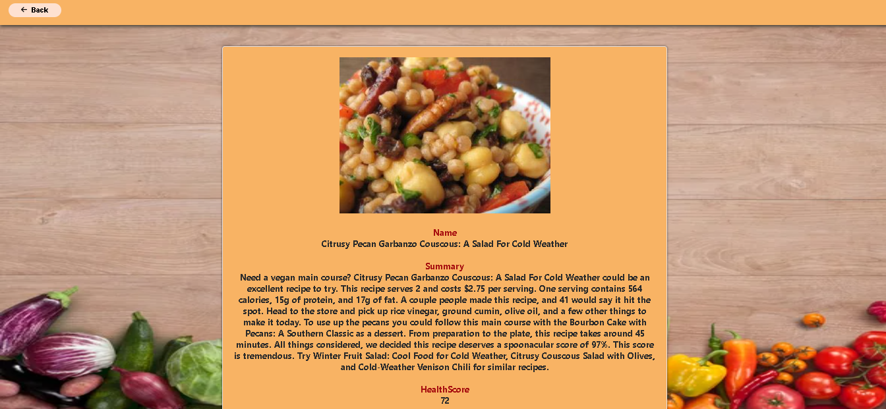
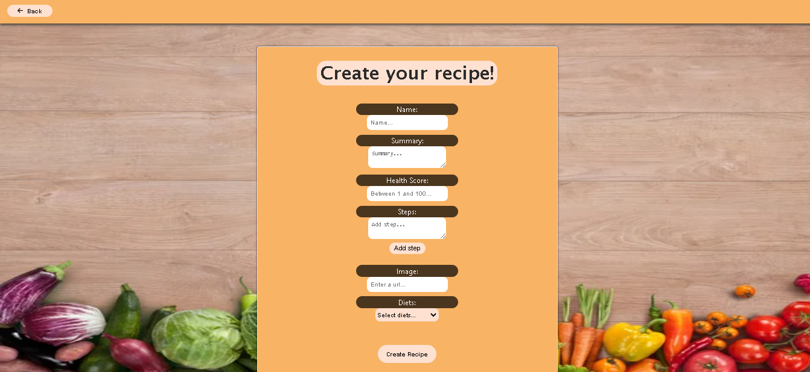
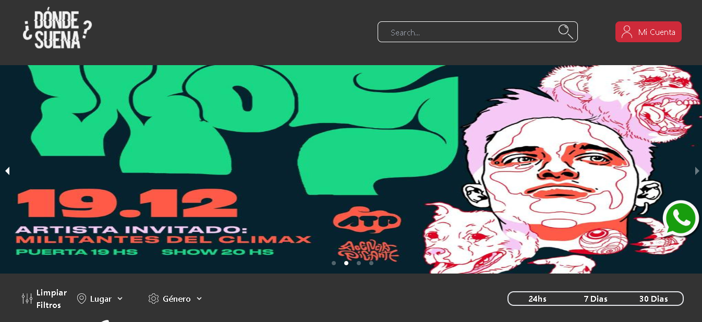
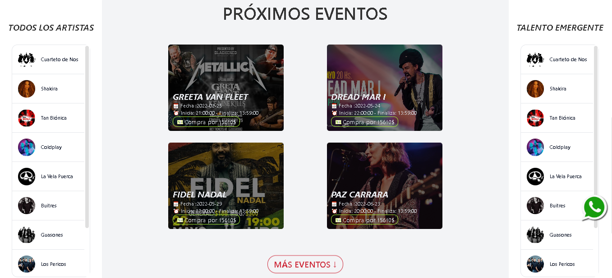
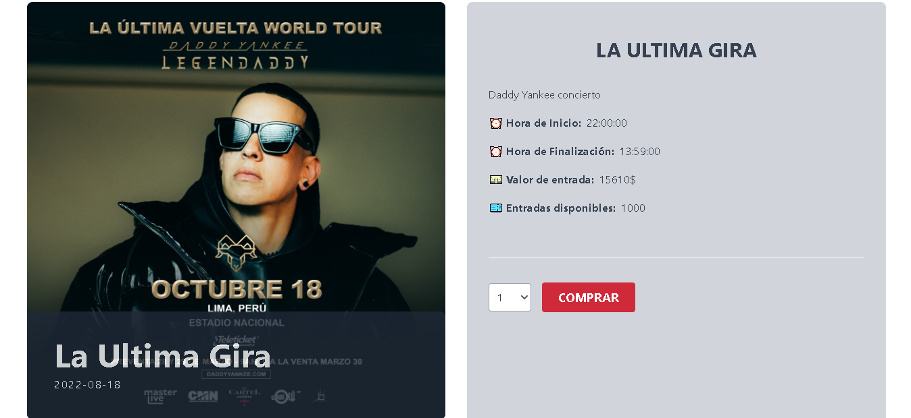
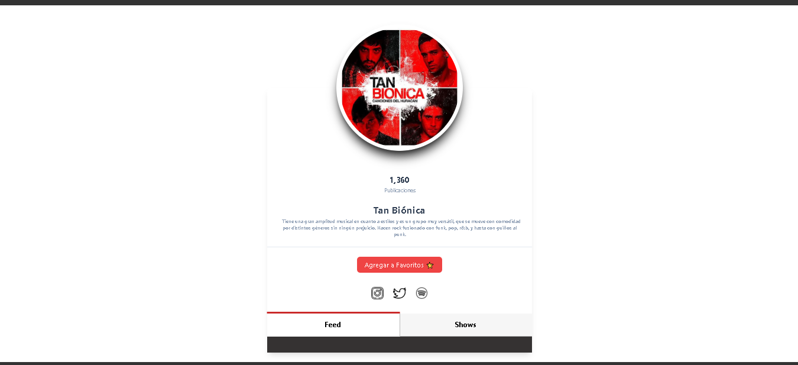

## 👩🏻‍💻 Sobre mí

Hola 🙋🏻‍♂️, mi nombre es Lautaro Santillan y soy Desarrollador Web Full Stack orientado a Front End. Actualmente estoy estudiando Ingenieria en Sistemas en la Universidad Tecnológica Nacional de Córdoba.

🔸 Me gusta trabajar en equipo y aprender de los demás, soy una persona responsable y curiosa. Siempre estoy dispuesto a afrontar nuevos retos y aprender cosas nuevas para seguir mejorando y creciendo en el camino de formarme como profesional.

🔸 Realicé el bootcamp de SoyHenry, en el cual tuve la oportunidad de ser Full Stack Teaching Asisstant, una gran experiencia que me ayudó a desarrollar mis habilidades técnicas y blandas a profundidad, y hacer que un grupo de personas que no se conocían entre sí pudieran congeniar, llevarse bien, divertirse y apoyarse mutuamente por lo que fue un reto que pude superar sin mucha dificultad.

## 🔧Tecnologías

## 🖥️ Proyectos

<a href="https://pi-food-lautaro-santillan.vercel.app/">Food App</a>

##

<a href="https://mi-scusi-books.vercel.app/">Donde Suena App</a>

## 📊 GitHub Stats

&nbsp;

## 📧 Contacto

<a href="https://mail.google.com/mail/u/0/?fs=1&to=lautiisantillan8@gmail.com&tf=cm">
&nbsp;&nbsp;&nbsp;&nbsp;

