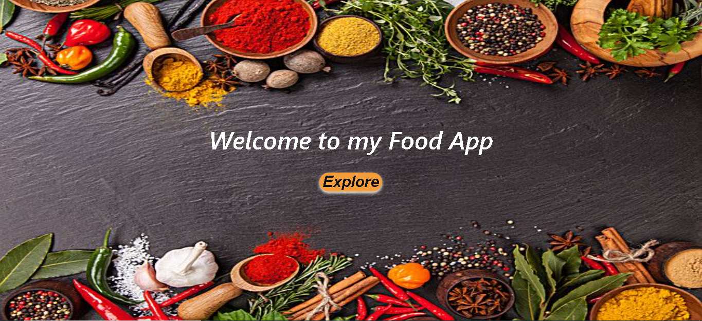

## 👩🏻‍💻 About Me

Hello 🙋🏻‍♂️, my name is Lautaro Santillan and I am a Full Stack Web Developer oriented to Front End.

🔸 I like working in a team and learning from others, I am a responsible and curious person. I am always willing to face new challenges and learn new things to keep improving and growing on the way to form myself as a professional.

🔸 I did the SoyHenry bootcamp, in which I had the opportunity to be a Full Stack Teaching Assistant, a great experience that helped me develop my technical and soft skills in depth, and make a group of people who did not know each other could get along, get along, have fun and support each other so it was a challenge that I could overcome without much difficulty.

## 🔧Languages and Tools

## 🖥️ Projects

<a href="https://pi-food-lautaro-santillan.vercel.app/">Food App</a>

